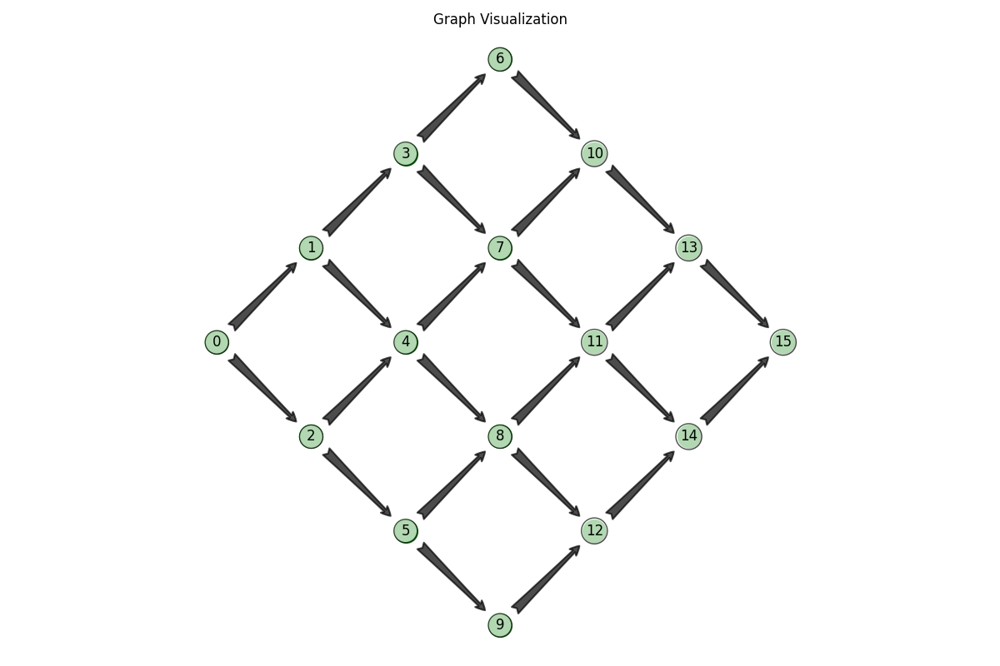
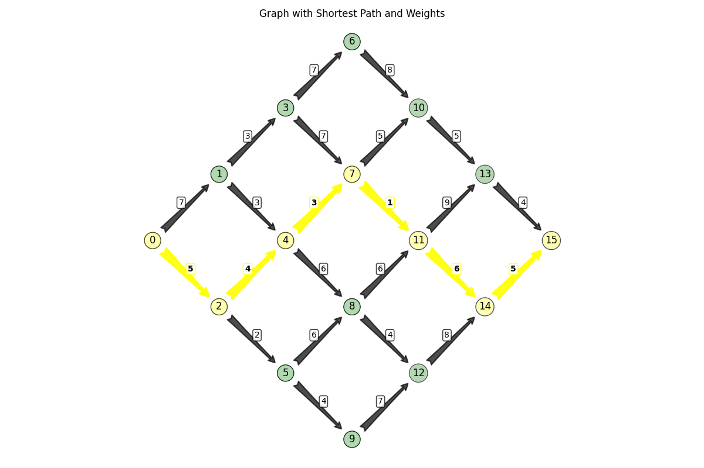

comments: true
---
# The Shortest Path problem with independent travel times

## Theoretical background
We will consider a directed graph $G=(V,E)$ with vertices $V=\{1,2,...,N\}$, edges $E\subset V \times V$ and
mean travel times $\Theta \in \mathbb{R}^{E}$. Vertex 1 is the source and $N$ the destination.
We will examine paths $x = (e_1, e_2, \ldots, e_k)$ where $e_i \in E$ for all $i \in \{1, 2, \ldots, k\}$ and
$e_1 =(1, n)$ and $e_k =(m, N)$.

Whenever we use a path $x$ for each edge $e$ we observe a travel time $y_{e}$.
The prior distribution that we will use for the mean travel time $\theta_{e}$ is:
$$
\theta_{e} \sim \text{LogNormal}(\mu_{e}, \sigma^2_{e}),
$$
where
$$
\mathbb{E}[\theta_{e}] = \Theta_{e} = e^{\mu_{e} + \sigma^2_{e}/2}.
$$

We further assume that observed travel times are drawn from:
$$
y_e| \theta_e \sim \text{LogNormal}(\ln(\theta_e) - \frac{\tilde{\sigma}}{2}, \tilde{\sigma}^2),
$$
so that:
$$
\mathbb{E}[y_e|\theta_{e}] = \theta_{e}
$$

The update is given by:
$$
\left(\mu_e, \sigma_e^2\right) \leftarrow \left(
\frac{1}{\frac{1}{\sigma_e^2} + \frac{1}{\tilde{\sigma}^2}}
\left( \frac{\mu_e}{\sigma_e^2} + \frac{\ln(y_{t,e}) + \frac{\tilde{\sigma}^2}{2}}{\tilde{\sigma}^2} \right),
\frac{1}{\frac{1}{\sigma_e^2} + \frac{1}{\tilde{\sigma}^2}}
\right)
$$

## Example

We will consider the following graph:

```python
import numpy as np
import matplotlib.pyplot as plt
from matplotlib.patches import FancyArrowPatch

# Define the graph
nodes = range(16)
edges = {(0, 1), (0, 2),
         (1, 3), (1, 4), (2, 4), (2, 5),
         (3, 6), (3, 7), (4, 7), (4, 8), (5, 8), (5, 9),
         (6, 10), (7, 10), (7, 11), (8, 11), (8, 12), (9, 12),
         (10, 13), (11, 13), (11, 14), (12, 14),
         (13, 15), (14, 15)
         }

# Definition of the graph
graph = {k: {l for l in nodes if (k,l) in edges} for k in nodes}
coordinates = [(0, 0),
               (1, 1), (1, -1),
               (2, 2), (2, 0), (2, -2),
               (3, 3), (3, 1), (3, -1), (3, -3),
               (4, 2), (4, 0), (4, -2),
               (5, 1), (5, -1),
               (6, 0)
               ]


```


## Helper functions
### Plots and shortest path
- Plot graph
- Plot graph with path
- Dijkstra algorithm
- Get the shortest path


```python
import heapq
import numpy as np
import matplotlib.pyplot as plt
from matplotlib.patches import FancyArrowPatch

def plot_graph(nodes, edges, coordinates, node_size=400, node_color='green',
               edge_color='black', arrow_style='fancy', node_labels=True,
               title='Graph Visualization', figsize=(12, 8), show=True):
    """
    Plot a directed graph with nodes and edges.

    Parameters:
    -----------
    nodes : list or range
        The nodes in the graph.
    edges : set of tuples
        The edges in the graph as (source, target) tuples.
    coordinates : list of tuples
        The (x, y) coordinates for each node.
    node_size : int, optional
        Size of the nodes. Default is 400.
    node_color : str, optional
        Color of the nodes. Default is 'green'.
    edge_color : str, optional
        Color of the edges. Default is 'black'.
    arrow_style : str, optional
        Style of the arrow. Default is 'fancy'.
    node_labels : bool, optional
        Whether to display node labels. Default is True.
    title : str, optional
        Title of the plot. Default is 'Graph Visualization'.
    figsize : tuple, optional
        Figure size. Default is (12, 8).
    show : bool, optional
        Whether to display the plot. Default is True.

    Returns:
    --------
    fig, ax : matplotlib figure and axis objects
        The figure and axis objects for further customization.
    """


    # Extract x and y coordinates
    x_coords = [tup[0] for tup in coordinates]
    y_coords = [tup[1] for tup in coordinates]

    # Create figure and axis
    fig, ax = plt.subplots(figsize=figsize)

    # Node radius for determining arrow endpoints
    node_radius = 0.2  # Adjust based on node size

    # Plot directed edges with shortened arrows
    for edge in edges:
        start, end = edge

        # Get start and end coordinates
        start_x, start_y = x_coords[start], y_coords[start]
        end_x, end_y = x_coords[end], y_coords[end]

        # Calculate direction vector
        dx = end_x - start_x
        dy = end_y - start_y

        # Calculate distance between nodes
        length = np.sqrt(dx**2 + dy**2)

        # Normalize direction vector
        dx, dy = dx/length, dy/length

        # Adjust start and end points to avoid overlapping with nodes
        new_start_x = start_x + node_radius * dx
        new_start_y = start_y + node_radius * dy
        new_end_x = end_x - node_radius * dx
        new_end_y = end_y - node_radius * dy

        # Create an arrow with adjusted endpoints
        arrow = FancyArrowPatch(
            (new_start_x, new_start_y),
            (new_end_x, new_end_y),
            arrowstyle=arrow_style,
            connectionstyle='arc3,rad=0',
            color=edge_color,
            lw=1.5,
            alpha=0.7,
            mutation_scale=20,  # Controls arrow head size
        )
        ax.add_patch(arrow)

    # Plot nodes
    ax.scatter(x_coords, y_coords, s=node_size, c=node_color, zorder=2)

    # Add node labels if requested
    if node_labels:
        for i, (x, y) in enumerate(zip(x_coords, y_coords)):
            ax.text(x, y, str(i), fontsize=12, ha='center', va='center',
                   bbox=dict(facecolor='white', alpha=0.7, boxstyle='circle'))

    # Add title
    ax.set_title(title)

    # Turn off axes
    ax.axis('off')

    # Set equal aspect ratio
    ax.set_aspect('equal')

    # Apply tight layout
    plt.tight_layout()

    # Show the plot if requested
    if show:
        plt.show()

    return fig, ax

def plot_graph_with_path(nodes, edges, coordinates, weights=None, path=None, used_edges=None,
                         node_size=400, node_color='green', edge_color='black',
                         path_color='red', path_width=2.5, arrow_style='fancy',
                         node_labels=True, weight_labels=True, weight_fontsize=10,
                         weight_offset=0.1, title='Graph with Path',
                         figsize=(12, 8), show=True):
    """
    Plot a directed graph with nodes, edges, weights, and an optional highlighted path.

    Parameters:
    -----------
    nodes : list or range
        The nodes in the graph.
    edges : set of tuples
        The edges in the graph as (source, target) tuples.
    coordinates : list of tuples
        The (x, y) coordinates for each node.
    weights : dict, optional
        Dictionary mapping edge tuples (source, target) to their weights.
    path : list, optional
        A list of nodes forming a path to highlight.
    used_edges : set of tuples, optional
        Set of edges to highlight as (source, target) tuples.
    node_size : int, optional
        Size of the nodes. Default is 400.
    node_color : str, optional
        Color of the regular nodes. Default is 'green'.
    edge_color : str, optional
        Color of the regular edges. Default is 'black'.
    path_color : str, optional
        Color for highlighting the path. Default is 'red'.
    path_width : float, optional
        Width of the highlighted path edges. Default is 2.5.
    arrow_style : str, optional
        Style of the arrow. Default is 'fancy'.
    node_labels : bool, optional
        Whether to display node labels. Default is True.
    weight_labels : bool, optional
        Whether to display edge weight labels. Default is True.
    weight_fontsize : int, optional
        Font size for weight labels. Default is 10.
    weight_offset : float, optional
        Offset for positioning weight labels. Default is 0.1.
    title : str, optional
        Title of the plot. Default is 'Graph with Path'.
    figsize : tuple, optional
        Figure size. Default is (12, 8).
    show : bool, optional
        Whether to display the plot. Default is True.

    Returns:
    --------
    fig, ax : matplotlib figure and axis objects
        The figure and axis objects for further customization.
    """

    # Extract x and y coordinates
    x_coords = [tup[0] for tup in coordinates]
    y_coords = [tup[1] for tup in coordinates]

    # Create figure and axis
    fig, ax = plt.subplots(figsize=figsize)

    # Node radius for determining arrow endpoints
    node_radius = 0.2

    # First, plot regular edges
    for edge in edges:
        # Skip if this edge is in the path (we'll draw it separately)
        if used_edges and edge in used_edges:
            continue

        start, end = edge

        # Get coordinates
        start_x, start_y = x_coords[start], y_coords[start]
        end_x, end_y = x_coords[end], y_coords[end]

        # Calculate direction vector
        dx = end_x - start_x
        dy = end_y - start_y

        # Calculate distance
        length = np.sqrt(dx**2 + dy**2)

        # Normalize direction vector
        dx, dy = dx/length, dy/length

        # Adjust endpoints
        new_start_x = start_x + node_radius * dx
        new_start_y = start_y + node_radius * dy
        new_end_x = end_x - node_radius * dx
        new_end_y = end_y - node_radius * dy

        # Create arrow
        arrow = FancyArrowPatch(
            (new_start_x, new_start_y),
            (new_end_x, new_end_y),
            arrowstyle=arrow_style,
            connectionstyle='arc3,rad=0',
            color=edge_color,
            lw=1.5,
            alpha=0.7,
            mutation_scale=20,
        )
        ax.add_patch(arrow)

        # Add weight label if weights are provided
        if weight_labels and weights and edge in weights:
            # Calculate position for weight label (midpoint with a small offset)
            mid_x = (start_x + end_x) / 2
            mid_y = (start_y + end_y) / 2

            # Add a small perpendicular offset to avoid overlap with the arrow
            perp_dx = -dy  # Perpendicular to direction vector
            perp_dy = dx   # Perpendicular to direction vector

            label_x = mid_x + weight_offset * perp_dx
            label_y = mid_y + weight_offset * perp_dy

            # Add weight label
            ax.text(label_x, label_y, str(weights[edge]),
                   fontsize=weight_fontsize, ha='center', va='center',
                   bbox=dict(facecolor='white', alpha=0.8, boxstyle='round,pad=0.2'))

    # Then plot path edges, if any
    if used_edges:
        for edge in used_edges:
            start, end = edge

            # Get coordinates
            start_x, start_y = x_coords[start], y_coords[start]
            end_x, end_y = x_coords[end], y_coords[end]

            # Calculate direction vector
            dx = end_x - start_x
            dy = end_y - start_y

            # Calculate distance
            length = np.sqrt(dx**2 + dy**2)

            # Normalize direction vector
            dx, dy = dx/length, dy/length

            # Adjust endpoints
            new_start_x = start_x + node_radius * dx
            new_start_y = start_y + node_radius * dy
            new_end_x = end_x - node_radius * dx
            new_end_y = end_y - node_radius * dy

            # Create arrow for path edge (with different style)
            path_arrow = FancyArrowPatch(
                (new_start_x, new_start_y),
                (new_end_x, new_end_y),
                arrowstyle=arrow_style,
                connectionstyle='arc3,rad=0',
                color=path_color,
                lw=path_width,
                alpha=0.9,
                mutation_scale=25,
            )
            ax.add_patch(path_arrow)

            # Add weight label if weights are provided
            if weight_labels and weights and edge in weights:
                # Calculate position for weight label (midpoint with a small offset)
                mid_x = (start_x + end_x) / 2
                mid_y = (start_y + end_y) / 2

                # Add a small perpendicular offset to avoid overlap with the arrow
                perp_dx = -dy  # Perpendicular to direction vector
                perp_dy = dx   # Perpendicular to direction vector

                label_x = mid_x + weight_offset * perp_dx
                label_y = mid_y + weight_offset * perp_dy

                # Add weight label with different style for path edges
                ax.text(label_x, label_y, str(weights[edge]),
                       fontsize=weight_fontsize, ha='center', va='center', color='black', fontweight='bold',
                       bbox=dict(facecolor='white', alpha=0.8, edgecolor=path_color, boxstyle='round,pad=0.2'))

    # Plot nodes with different colors for path nodes
    if path:
        # Create node colors list - path nodes get a different color
        node_colors = [path_color if i in path else node_color for i in nodes]
        ax.scatter(x_coords, y_coords, s=node_size, c=node_colors, zorder=2)
    else:
        # All nodes have the same color
        ax.scatter(x_coords, y_coords, s=node_size, c=node_color, zorder=2)

    # Add node labels if requested
    if node_labels:
        for i, (x, y) in enumerate(zip(x_coords, y_coords)):
            ax.text(x, y, str(i), fontsize=12, ha='center', va='center',
                   bbox=dict(facecolor='white', alpha=0.7, boxstyle='circle'))

    # Add title
    ax.set_title(title)

    # Turn off axes
    ax.axis('off')

    # Set equal aspect ratio
    ax.set_aspect('equal')

    # Apply tight layout
    plt.tight_layout()

    # Show the plot if requested
    if show:
        plt.show()

    return fig, ax

def dijkstra_with_paths(graph, start, weights):
    """
    Find shortest paths from start node to all other nodes using Dijkstra's algorithm.

    Args:
        graph: Dictionary with nodes as keys and sets of neighboring nodes as values
        start: Starting node index
        weights: Dictionary mapping edge tuples (source, destination) to their weights

    Returns:
        distances: Dictionary of shortest distances from start to each node
        predecessors: Dictionary of predecessors for each node in the shortest path
    """
    # Initialize distances with infinity for all nodes except start
    distances = {node: np.inf for node in graph}
    distances[start] = 0

    # Dictionary to store predecessors
    predecessors = {node: None for node in graph}

    # Priority queue with (distance, counter, node)
    pq = [(0, 0, start)]
    counter = 1

    # Visited set to track processed nodes
    visited = set()

    while pq:
        # Get node with smallest distance
        current_distance, _, current_node = heapq.heappop(pq)

        # Skip if already processed
        if current_node in visited:
            continue

        # Mark as visited
        visited.add(current_node)

        # Process all neighbors
        for neighbor in graph[current_node]:
            # Skip if already processed
            if neighbor in visited:
                continue

            # Find the edge weight - adapt to your weight structure
            edge_weight = weights[(current_node, neighbor)]

            # Calculate new distance
            new_distance = current_distance + edge_weight

            # Update if we found a shorter path
            if new_distance < distances[neighbor]:
                distances[neighbor] = new_distance
                predecessors[neighbor] = current_node
                heapq.heappush(pq, (new_distance, counter, neighbor))
                counter += 1

    return distances, predecessors


def get_shortest_path(predecessors, end):
    """
    Reconstruct the shortest path from start to end using predecessors.

    Args:
        predecessors: Dictionary of predecessors where keys are node indices
        start: Starting node index
        end: Ending node index
        names: List of node names corresponding to their indices

    Returns:
        tuple: (path, used_edges) where:
            - path is a list representing the shortest path from start to end with node names
            - used_edges is a set of tuples (from_node, to_node) representing the edges used
    """
    path = []
    used_edges = set()
    current = end

    # No path exists
    if predecessors[end] is None and start != end:
        return [], set()

    # Build path in reverse
    while current is not None:
        path.append(current)

        # Add the edge to used_edges if there is a predecessor
        predecessor = predecessors[current]
        if predecessor is not None:
            # Add edge (predecessor, current) to used_edges
            used_edges.add((predecessor, current))

        current = predecessor

    # Reverse to get path from start to end
    return path[::-1], used_edges

# we use some random distances for the set of edges
weights = {
    e: np.random.randint(1, 10) for e in edges
}
start = 0
end = 15
distances, predecessors  = dijkstra_with_paths(graph, start, weights)
path_, used_edges = get_shortest_path(predecessors, end)
plot_graph(nodes,edges,coordinates, title='Example Graph')
fig, ax = plot_graph_with_path(
    nodes,
    edges,
    coordinates,
    weights=weights,  # Pass your weights dictionary
    path=path,
    used_edges=used_edges,
    title='Graph with Shortest Path and Weights',
    path_color="yellow"
)


```




### Sampling functions
- sampling from the true distribution of a path
- create the statistics required for Bayesian update of normal with known variance
- single step in the Thompson sampling process
```python
from conjugate.distributions import Normal
from conjugate.models import normal_known_variance

ini_sigma = 1
sigma_tilda = 1
ordered_edges = list(edges)
edge_to_index = {ordered_edges[k]: k for k in range(len(ordered_edges))}
means = np.array([np.log(weights[edge]) - (ini_sigma) ** 2 / 2 for edge in edges])
sigma = np.ones(means.shape[0]) * (ini_sigma)
true_dist = Normal(mu=means, sigma=sigma)

def sample_true_distribution(
        edges_to_sample: list,
        rng,
        true_dist: Normal = true_dist,
) -> float:
    return [true_dist[edge_to_index[edge]].dist.rvs(random_state=rng) for edge in edges_to_sample]


def bayesian_update_stats(
        edges_sampled: list,
        edges_sample: list,
        n_edges: int = len(edges),
) -> tuple[np.ndarray, np.ndarray]:
    x = np.zeros(n_edges)
    n = np.zeros(n_edges)

    mask = [edge_to_index[edge] for edge in edges_sampled]
    x[mask] = np.log(np.exp(edges_sample)) - (sigma_tilda ** 2) / 2
    n[mask] = 1

    return x, n


def thompson_step(estimate: Normal, rng) -> Normal:
    sample = estimate.dist.rvs(random_state=rng)
    weights_ = {ordered_edges[k]: np.exp(sample[k]) for k in range(len(edges))}
    _, predecesors = dijkstra_with_paths(graph, start,weights_ )
    path, edges_to_sample = get_shortest_path(predecesors, 15)
    print(path)
    edges_sample = sample_true_distribution(edges_to_sample, rng=rng)
    x, n = bayesian_update_stats(edges_to_sample, edges_sample)

    return normal_known_variance(x_total=x, n=n, var=sigma_tilda, prior=estimate)
```
```python
mu = np.ones(len(edges)) * -0.5
sigma = np.ones(len(edges))
estimate = Normal(mu=mu, sigma=sigma)

rng = np.random.default_rng(42)

total_samples = 250
for _ in range(total_samples):
    estimate = thompson_step(estimate=estimate, rng=rng)


```
